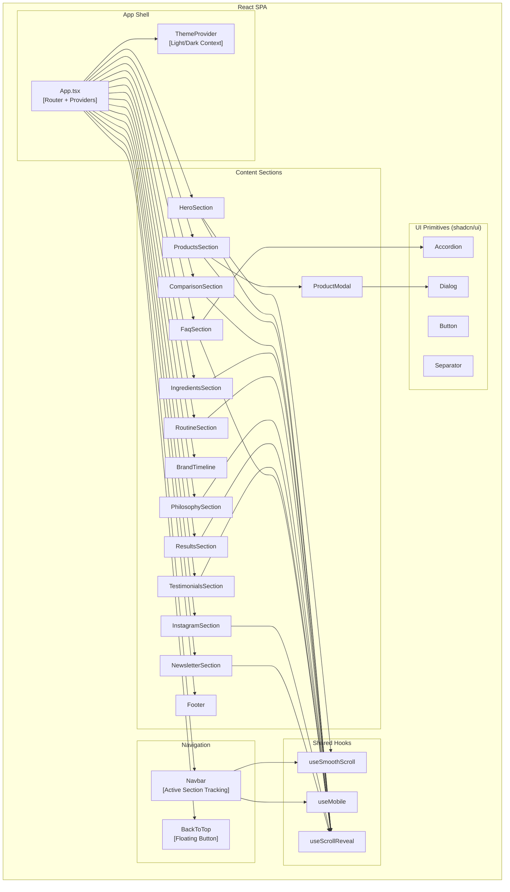

# C4 Component — Gently Pure

## Component Diagram

## Component Groups

### App Shell

The App Shell provides the top-level structure: theme context (light mode default), client-side routing via Wouter, tooltip provider, and toast notifications via Sonner. The `Home` page composes all section components in a defined order.

### Navigation Components

**Navbar** is the primary navigation component. It tracks the active section using `IntersectionObserver` and highlights the corresponding nav link with a sage dot indicator. On mobile (< 768px), it collapses into a hamburger icon that opens an animated slide-out drawer with staggered link animations and body scroll lock.

**BackToTop** is a floating button that appears after scrolling 400px. It smoothly scrolls the user back to the top of the page.

### Content Section Components

Each section is a self-contained component with its own data, scroll-reveal animations, and responsive layout. They are composed in `Home.tsx` in this order:

| Order | Component | Key Interactions |
|---|---|---|
| 1 | HeroSection | Smooth scroll CTAs to Products and Philosophy |
| 2 | ProductsSection | Hover animations, quick-view modal trigger |
| 3 | ComparisonSection | Side-by-side table with bundle CTA |
| 4 | IngredientsSection | Hover-lift ingredient cards |
| 5 | RoutineSection | 3-step visual guide |
| 6 | PhilosophySection | Editorial pull quote with brand values |
| 7 | BrandTimeline | Click-to-expand milestone pop-ups with stats |
| 8 | ResultsSection | Tabbed before/after gallery |
| 9 | TestimonialsSection | Auto-rotating slider with dot/arrow controls |
| 10 | FaqSection | Three-column accordion by category |
| 11 | NewsletterSection | Email input with subscribe CTA |
| 12 | InstagramSection | Edge-to-edge photo grid with hover overlays |
| 13 | Footer | Site links with smooth scroll navigation |

### Shared Hooks

**useScrollReveal** attaches an `IntersectionObserver` to a container ref. When `.reveal` children enter the viewport (10% threshold), it adds the `.visible` class to trigger CSS entrance animations.

**useSmoothScroll** returns a `scrollToSection` function that performs custom JavaScript smooth scrolling with a 900ms cubic ease-in-out curve and automatic navbar offset compensation.

**useMobile** returns a boolean indicating whether the viewport is below the mobile breakpoint (768px), using a `matchMedia` listener.

### UI Primitives

The project uses shadcn/ui components built on Radix UI primitives. Key components in use include Accordion (FAQ section), Dialog (product modal), Button (CTAs throughout), Separator (visual dividers), and Tooltip (nav tooltips).

## Component Dependencies

| Component | Depends On |
|---|---|
| Navbar | useSmoothScroll, useMobile, IntersectionObserver API |
| HeroSection | useScrollReveal, useSmoothScroll |
| ProductsSection | useScrollReveal, ProductModal |
| ProductModal | Dialog (shadcn/ui), Framer Motion |
| ComparisonSection | useScrollReveal |
| IngredientsSection | useScrollReveal |
| RoutineSection | useScrollReveal |
| PhilosophySection | useScrollReveal |
| BrandTimeline | useScrollReveal, Framer Motion (AnimatePresence) |
| ResultsSection | useScrollReveal |
| TestimonialsSection | useScrollReveal |
| FaqSection | useScrollReveal, Accordion (shadcn/ui) |
| InstagramSection | useScrollReveal |
| NewsletterSection | useScrollReveal |
| Footer | useSmoothScroll |
| BackToTop | Window scroll event |
