# C4 Container — Gently Pure

## Container Diagram

```mermaid
graph TB
    subgraph "Gently Pure System"
        SPA["🌐 React SPA<br/>[Vite + React 19 + Tailwind 4]<br/>Single-page landing page"]
    end
    
    subgraph "External Services"
        GF["Google Fonts<br/>[CDN]"]
        ICDN["Image CDN<br/>[Cloud Storage]"]
        Umami["Umami Analytics<br/>[SaaS]"]
    end
    
    subgraph "Infrastructure"
        Vercel["Vercel Edge Network<br/>[Static Hosting + CDN]"]
        GitHub["GitHub<br/>[Source Control]"]
    end
    
    User["👤 Visitor"] -->|"HTTPS"| Vercel
    Vercel -->|"Serves static files"| SPA
    SPA -->|"Font requests"| GF
    SPA -->|"Image requests"| ICDN
    SPA -->|"Analytics events"| Umami
    GitHub -->|"Git push triggers<br/>auto-deploy"| Vercel
```



## Containers

### React Single-Page Application

| Property | Value |
|---|---|
| **Name** | Gently Pure SPA |
| **Type** | Web Application (Static) |
| **Technology** | React 19, TypeScript 5.6, Tailwind CSS 4, Vite 7 |
| **Deployment** | Vercel (static files served from edge CDN) |
| **Entry Point** | `client/index.html` → `client/src/main.tsx` → `client/src/App.tsx` |

This is the sole container in the current architecture. It is a client-side-only React application that renders all content in the browser. There is no server container, database container, or API container.

**Components within this container:**

| Component | File | Purpose |
|---|---|---|
| App Shell | `App.tsx` | Theme provider, routing, toast notifications |
| Navbar | `Navbar.tsx` | Navigation with active section indicator and mobile drawer |
| Hero Section | `HeroSection.tsx` | Brand introduction with split layout |
| Products Section | `ProductsSection.tsx` | Product cards with hover effects and quick-view trigger |
| Product Modal | `ProductModal.tsx` | Lightbox with detailed product information |
| Comparison Section | `ComparisonSection.tsx` | Side-by-side product comparison table |
| Ingredients Section | `IngredientsSection.tsx` | Natural ingredient showcase |
| Routine Section | `RoutineSection.tsx` | 3-step daily skincare routine guide |
| Philosophy Section | `PhilosophySection.tsx` | Brand values and editorial quote |
| Brand Timeline | `BrandTimeline.tsx` | Interactive milestone timeline with pop-ups |
| Results Section | `ResultsSection.tsx` | Before/after customer transformation gallery |
| Testimonials Section | `TestimonialsSection.tsx` | Auto-rotating customer review slider |
| FAQ Section | `FaqSection.tsx` | Categorized accordion with common questions |
| Instagram Section | `InstagramSection.tsx` | Social proof photo grid |
| Newsletter Section | `NewsletterSection.tsx` | Email capture form |
| Footer | `Footer.tsx` | Site links, brand info, legal |
| Back to Top | `BackToTop.tsx` | Floating scroll-to-top button |

**Shared utilities:**

| Utility | File | Purpose |
|---|---|---|
| Scroll Reveal Hook | `useScrollReveal.ts` | IntersectionObserver-based entrance animations |
| Smooth Scroll Hook | `useSmoothScroll.ts` | Custom JS smooth scrolling with easing |
| Mobile Detection Hook | `useMobile.tsx` | Responsive breakpoint detection |
| Class Utility | `lib/utils.ts` | `cn()` function for conditional Tailwind classes |

### Vercel Edge Network (Infrastructure)

| Property | Value |
|---|---|
| **Name** | Vercel Hosting |
| **Type** | Static File Server + CDN |
| **Configuration** | `vercel.json` |
| **Build Command** | `cd client && pnpm install && pnpm run build` |
| **Output Directory** | `client/dist` |

Vercel serves the built static files with the following configuration: SPA rewrites (all routes serve `index.html`), security headers (X-Content-Type-Options, X-Frame-Options, X-XSS-Protection, Referrer-Policy), and static asset caching (1 year for `_assets/` directory).

## Communication Protocols

| From | To | Protocol | Data |
|---|---|---|---|
| Browser | Vercel | HTTPS | HTML, CSS, JS requests |
| SPA | Google Fonts | HTTPS | Font file requests (woff2) |
| SPA | Image CDN | HTTPS | Image file requests (jpg, png, webp) |
| SPA | Umami | HTTPS | Page view and event analytics |
| GitHub | Vercel | Webhook | Git push triggers deployment |

## Build Pipeline

```
Source Code (GitHub)
    ↓ git push
Vercel Build
    ↓ pnpm install
    ↓ pnpm run build (Vite)
    ↓ Output: dist/public/
Vercel Edge CDN
    ↓ Global distribution
End Users (Browser)
```
