# C4 Context — Gently Pure

## System Context Diagram

```mermaid
graph TB
    User["👤 Website Visitor<br/>(Sensitive skin consumer)"]
    Admin["👤 Brand Owner<br/>(Content manager)"]
    
    GP["🌿 Gently Pure<br/>Landing Page<br/>[React SPA]"]
    
    GF["Google Fonts<br/>[External Service]"]
    CDN["Image CDN<br/>[External Service]"]
    Umami["Umami Analytics<br/>[External Service]"]
    Vercel["Vercel<br/>[Hosting Platform]"]
    
    User -->|"Browses products,<br/>reads content,<br/>subscribes to newsletter"| GP
    Admin -->|"Manages content<br/>via code updates"| GP
    
    GP -->|"Loads Fraunces<br/>& Karla fonts"| GF
    GP -->|"Loads product &<br/>lifestyle images"| CDN
    GP -->|"Sends page view<br/>& event data"| Umami
    GP -->|"Deployed &<br/>served from"| Vercel
```

## System Overview

Gently Pure is a **static single-page application** that serves as the digital storefront for a sensitive skincare brand. It is a client-side-only React application with no backend server, database, or API. All content is embedded in the application code, and all assets are served from external CDNs.

## Personas

### Website Visitor

The primary user is a health-conscious consumer researching skincare products for sensitive skin. They arrive via search engines, social media, or direct links. Their journey involves browsing product information, reading ingredients, viewing customer testimonials, and potentially subscribing to the newsletter or clicking "Add to Cart" (currently a placeholder for future e-commerce integration).

### Brand Owner

The secondary user is the brand owner or content manager who updates the site by modifying component files and redeploying. There is no CMS or admin panel — all content changes require code modifications.

## External Systems

| System | Type | Integration | Purpose |
|---|---|---|---|
| Google Fonts | CDN | `<link>` tags in HTML | Serves Fraunces and Karla typefaces |
| Image CDN | CDN | `` URLs in components | Serves all product, lifestyle, and gallery images |
| Umami Analytics | SaaS | `<script>` tag in HTML | Privacy-focused page view and event tracking |
| Vercel | PaaS | Git-triggered deployment | Hosts the static site with edge CDN distribution |
| GitHub | SaaS | Git repository | Source code version control and CI/CD trigger |

## Key Quality Attributes

| Attribute | Requirement | Implementation |
|---|---|---|
| Performance | < 3s load on 3G | Static site, external CDN images, font-display: swap |
| Accessibility | WCAG 2.1 AA | Semantic HTML, focus rings, ARIA attributes, contrast ratios |
| Responsiveness | Mobile-first | Tailwind breakpoints, hamburger menu, stacked layouts |
| Security | Standard web security | CSP headers, X-Frame-Options, no user data stored |
| Maintainability | Modular architecture | One component per section, shared hooks and utilities |

## Deployment Context

The application is built by Vite into static HTML, CSS, and JavaScript files. These files are deployed to Vercel's edge network, which serves them globally with automatic SSL, CDN caching, and SPA routing rewrites. There is no server-side rendering, no database, and no API layer.

## Future Context Evolution

When e-commerce is added (Phase 2), the system context will expand to include a backend server, PostgreSQL database, Stripe payment gateway, and Manus OAuth for user authentication. The static site will be upgraded to a full-stack application.
